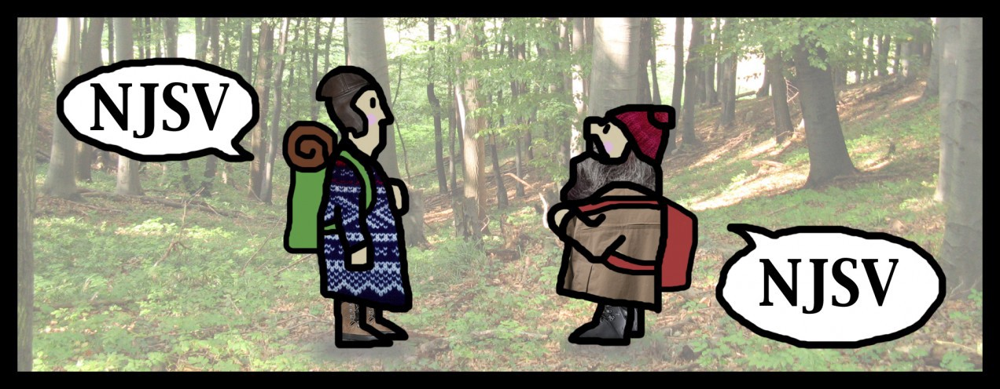

Til avslutninga på Facebook-gruppa Rollespill.info konkurranseserie Båtsj, der målet var å lage eit fungerande rollespel, fann eg og Lars ([S.G. Solbakken](http://twitter.com/dnoate/)) ut at me skulle delta. I løpet av ca. halvanna times Facebook-chat var grunnideen klar:

> _NJSV er eit GM-laust rollespel for to personar, inspirert av den norske folkesjela, og vår evne til å snakke om kva som helst så lenge det er medan me går på tur._

I løpet av nokre dagar fullførte me spelet, til eit tosiders A4-ark som er lenkja mot botnen av artikkelen.

Målet er å tilfeldigvis ha felles interesser i såpass stor grad at ein blir vener, og til slutt utvekslar telefonnummer. Tanken var at ein — i motsetning til mange andre konflikt-rollespel — skulle trille så nærme kvarandre som mogleg, med håp om å møtast i noko felles.

Ein litt tidlegare versjon av NJSV vart omtala som «lesespill», og det er mykje sanning i det. I større grad enn å faktisk bli spelt, så er det nesten tvungen yatzy med eit tynt lag nasjonalsatire rundt. Det skal fange det norske i å kunne ha ein klein samtale på fjellet, og mekanikken — sjølv om den skal vere relativt balansert — er eigentleg ikkje så farleg.

På den andre sida er det — som i yatzy — fullstendig mogeleg å spele NJSV utan å nokosinne faktisk gjere rollespeling, men det er keisamt. Tanken er at det kan vere ei ramme for improteater, styrt av deterministiske terningar som bestemmer om du og din mot/med-spelar er vener eller ikkje, basert på spennande interessefelt som «Dramaserier på HBO».

Det var også viktig for oss at spelet skulle vere ekstremt kort (eg er sjølv glad i dei mange ulike variantane av «eitt A4-arks-spel»), men me endte opp på to sider for å kunne ha bittelitt pusterom — og også plass til illustrasjonar og diverse figurark.

Illustrasjonane er eg forresten ganske nøgd med. Den eine sugd fullstendig frå eiget bryst, medan den andre er skamlaust stole frå «Snekker Andersen & Julenissen» — berre i nye klede og spegelvendt — eit særnorsk litterært møte som eg reknar som den perfekte runden med NJSV.

Du kan sjå diskusjonen rundt NJSV og dei andre spela i konkurransen [her](https://www.facebook.com/groups/rollespill.info/permalink/1055533187824466/).

Du kan laste ned den hittil endelege versjonen av NJSV [her](http://rumbleinreehaug.com/random/NSJV-FIN.pdf).