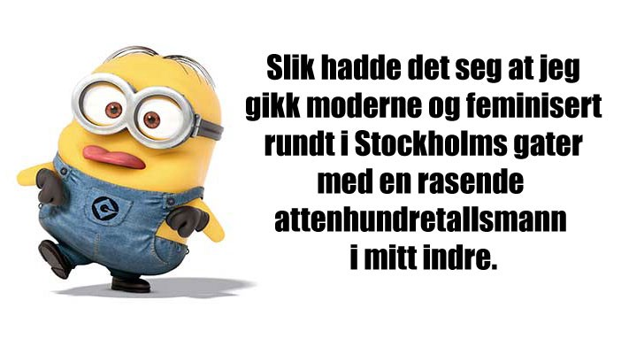
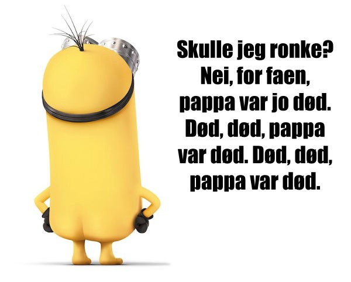
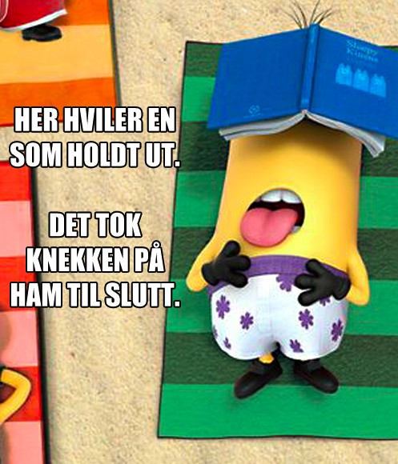

Eg likar teite prosjekt. Og eg elskar å blande saman to ting som ein vanlegvis ikkje tenkjer at kan blandast saman, kall det mashup-kultur eller kva som helst – ofte har eg iallfall sansen for det.

Difor har eg blant anna laga møter mellom [_Game of Thrones_ og _Mot i Brøstet_](https://www.youtube.com/watch?v=zT0mHs5Uxc4), mellom [_Kampen om Tungtvannet_ og _Bare Bea_](https://www.youtube.com/watch?v=f08f7WiZtzs), og til og med [_Star Wars_ og _Friends_](https://www.youtube.com/watch?v=7F66-RfxgT0).

**Men den eg framleis har mest sansen for er** [**Knausgårdminions**](http://facebook.com/knausgaardminions/)**.**

Du finn fleire av dei på [Facebook](http://facebook.com/knausgaardminions/). 

Båe desse dukkar opp cirka to gongar i veka. Ha ein fin måndag!