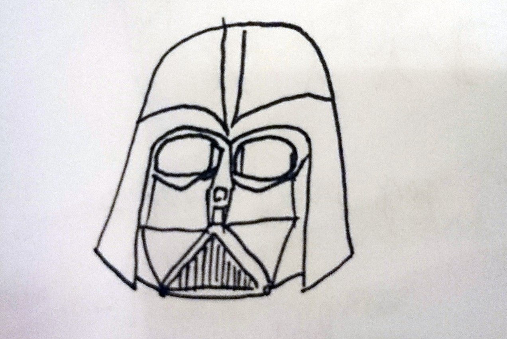
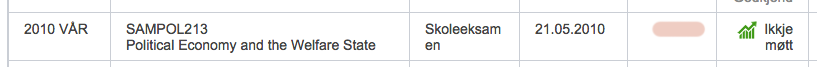
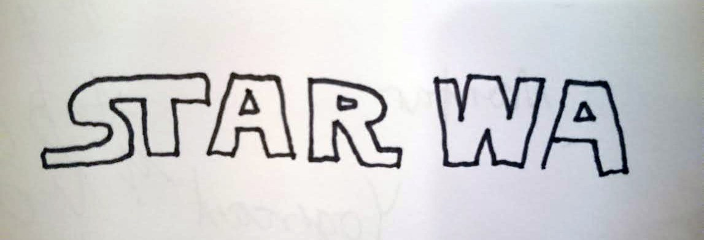

«Star Wars» er blant få ting som eg omtrent alltid kan hugse at har vore i livet mitt. Eg veit ikkje når minnet om Darth Vader først dukka opp som eit frø i fantasien min, men det må ha vore alt nokre år før eg faktisk såg nokre av filmane.

**Mest sannsynleg såg eg ikkje noko frå den originale trilogien før rundt 1997–1998 — då eg var rundt 10 år gammal (hjå ein kamerat med storebror), og eg hugsar at eg såg Episode I på kino — men lyssverd, kule romskip, og ei og anna velkjend svart maske var metaforisk tatovert på hjernebarken min allereie nokre år før dette.**

Eg kan framleis teikne ein heilt ok Darth Vader:

*Darth Vader på 2 minutt.*

Sidan dette har eg sett alle filmane fleire gongar enn eg kan hugse (men færre gongar enn «Istid» og «Zoolander»), og har spelt i fleire hjørner av universet enn eg tør tenkje på — anten det er i «Jedi Knight»-serien, gjentekne gongar i båe versjonar av «Knights of the Old Republic», i den demoen av «Battlefront» som fulgte med DVD-versjonen i 2004 (den første eg kjøpte for eigne pengar), alle «Angry Birds Star Wars»-versjonane, samt både i rollespelsform og brettspelsform rundt eit bord med vener.

Eg har også farta uti det såkalla Extended Universe i ulike bokprosjekt. Utan å ha lest altfor mange av dei kan eg likevel seie at det er langt mellom bøkene det er verdt å lese, og likevel altfor kort mellom bøkene det er lett å få tak i. Men begynn med «Heir to the Empire», [«A New Dawn»](http://tanketom.com/litteratur/2015/i-ar-skulle-eg-lese-12-boker-dette-var-det-eg-synest-om-dei/) eller «Darth Plagueis».

Opptil fleire gongar har eg sagt omtrent det følgjande:

> _Det er dritlett å få mange følgjarar på Twitter. Du må berre dra tilbake til_ [_2007_](http://tanketom.com/internett/2014/eg-har-vore-pa-twitter-i-7-ar/)_, og tweete alt nytt du kan finne om «Star Wars»._

Seinare har eg både snakka og skrive mykje om favorittgalaksa mi. Om du googlar namnet mitt + star wars finn du artiklar [her](http://tanketom.com/film/2014/star-wars-day-nar-fankultur-er-sterkare-enn-filmtabber/) (og [her](http://tanketom.com/ymse/2014/starwarsjulepynt-fordi-du-fortener-det/)), hjå Bergens Tidende, NRK P3, Filter Magasin, og dersom Studentradioen hadde behaldt tekstinnhaldet frå den tida eg var der, ville du ha funne ting der òg.

**Hjå Studentradioen sat eg i studio og snakka om 30-årsdagen til «Empire Strikes Back» medan eg eigentleg burde ha hatt eksamen i politisk økonomi. Her er eit slags bevis (sorry, mamma):**

**Sjølv gifteringen min har eit «Star Wars»-sitat. Og kona mi veit no at det Darth Vader eigentleg seier er «No, _I_ am your father!».**

Og alt dette starta med noko eg ikkje har peiling på når skjedde. «Star Wars» er ein av mine konstantar.

Om eg skal plukke fram eitt konkret minne frå tidleg alder ser eg til skulefritidsordninga på Lærdalsøyri Ungdomsskule, der eg hadde teikna ein heilt kompetent Darth Vader (iallfall for mine rundt 8–9 år å rekne), og så eit mislukka forsøk på å etterape «Star Wars»-logoen, som i mitt tilfelle såg omtrent sånn ut:

*STAR WA*

Fordi dette trass alt var ein god, sosialdemokratisk skulefritidsordning vart teikninga sjølvsagt likevel hengt opp på veggen. Nokre dagar seinare hadde ein av dei to år yngre ungane teikna av min Darth Vader, utan å vite kva «Star Wars» var, og i det uvitande plagiatets namn var også han betitla med «STAR WA».

**Dermed var endå eit frø sådd.**