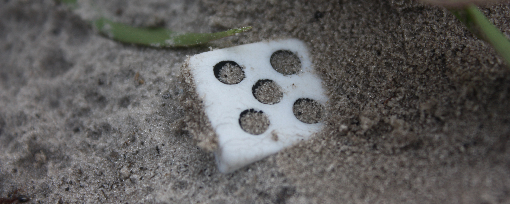

Eg har aldri likt terningkastet, som det tabloide grepet for kritikk eller anmelderi det faktisk er, og for mange anmeldarar er det eit slags påkrevd vonde. Men når Hanne Kristin Rohde i [Aftenposten](http://www.aftenposten.no/meninger/kronikker/Kronikk-Et-terningkast-kan-aldri-bli-mer-enn-tilfeldig--Hanne-Kristin-Rohde-8427274.html) i går ser seg tent med å angripe terningkastet spesielt, og anmelderiet generelt, så føler eg likevel for å forsvare det som har vore eit av arbeidsverktøya mine i nokre år.

Rohde skriv:

> Anmeldelsene er basert på en anmelder, en forfatter og en bok. En anmelder, en film, en regissør. En anmelder, en komponist, et album. osv. Tre (eller flere) instanser. Men kun én person har _formell_ makt etter utgivelsen: Anmelderen. Hans eller hennes vurdering blir stående.

Ein anmeldar – eller kritikar, det kjem an på mengden snobberi ein vil leggje i det – har absolutt inga _formell makt_. Om ein anmeldar hadde hatt formell makt, så hadde Venn-diagrammet mellom «kritikarrost» og «populær» vore ein enkel sirkel. Det motsatte – vist i alle bestselgjarlister nokosinne – er kanskje det fremste beviset på at ein anmeldar også i liten grad har _uformell makt_.

**Om formell makt hadde vore til stades hadde terningkastet endt med å vere fasiten – og det er det openbart at det ikkje er.**

Folk er usamde med kvarandre, dette er ikkje akkurat eit nytt fenomen i verdshistoria. Om alle anmeldarar hadde vore samde, hadde det om mogleg vore endå mindre vits med anmelderiet enn det er i dag. Om éin ting skal kome ut av dette, så må det vere mi generelle bemerkning om at det beste er å finne anmeldarar ein generelt sett er samde med, og nytte dei som ei slags rettesnor.

At norske debutforfattarar ikkje får mange nok anmeldingar til at det er lett å danne seg eit overblikk over verket er absolutt eit problem – men, overraskande nok, det er ikkje så mykje pengar i anmelderiet i ein allereie tynnsliten mediekvardag.

> Fra mitt ståsted som jurist og med 25 års bakgrunn i politiet, er det naturlig å stille spørsmålet: Hvor ellers i samfunnet godtar vi en slik ensidig domsavsigelse? Hvor ellers i samfunnet kan ett enkelt individ synse i full offentlighet og attpåtil få sitt standpunkt formalisert som en slags sannhet uten saksbehandling, kontradiksjon, vurdering av habilitet og ankemuligheter?

**Over alt. Absolutt over alt. Nokre gongar om dagen på nyheitene, hundrevis av gongar på Twitter, og mogelegens titusenvis av gongar på Facebook. Kvar einaste dag. «Everyone’s a critic!»**

Og det har vore mange debattar i Noreg rundt dette. På filmsida, som er der eg trass alt har vore mest borti, har nettmagasinet Montages vore ein av dei fremste premissleverandørane for dette, først i 2010 med [«Den akutte krisen i norsk filmkritikk»](http://montages.no/2010/12/den-akutte-krisen-i-norsk-filmkritikk/) med påfølgjande innhopp i Dagsnytt 18 — til no seinast gjennom [forordet av produsent Maria Ekerhovd](http://montages.no/2016/02/hvordan-snakke-om-norsk-film-filmkritiker-kristin-aalen-debatterer-med-produsent-maria-ekerhovd/) i magasinets nyutgitte bok. Internasjonalt er diskusjonen endå meir aktiv, og rullar opp no og då.

Kronikken er likevel det fremste eksempelet på den forhasta debattens borg. Dette kjem eg attende til.

> Det finnes neppe mange kunstnere som har opplevd å få en kulturell tilsvarsrett under arbeidet med en anmeldelse. Hvorfor skal ikke kunstneren få uttale seg om sitt verk i selve anmeldelsen?

Først og fremst har nok dette med tradisjon å gjere. Men ein kronikk i Aftenposten må då sjåast på som tilsvarsrett – då tilsvarsretten som oftast er ettergåande, ikkje samtidig.

Sjølv om tanken i prinsippet er lik, har det skjedd mykje i anmelderiet sidan Aristoteles skreiv kritiske om samtidig kunst i det fjerde århundret før Kristus.

Ellers er det vel kanskje _imøtegåelsesretten_ du kan hevde at det er mangel på, her har me òg nokre spennande prosjekt her til lands. Til dømes fekk BTs litteraturanmeldar Silje Stavrum Fritt Ord-støtte for eit prosjekt der ein [dialog med kunstnaren](http://bok365.no/artikkel/lanserer-anmeldelser-som-dialog/#.VxIlIJOLS8p) vart ein del av anmeldinga—eit spennande tillegg til sjangeren.

Det første var [eit møte med Marit Eikemo](http://www.bt.no/kultur/Begeistret-og-irritert-3426349.html?spid_rel=2) (bak betalingsmur).

> Det jeg _ikke_ trenger er en betalt vurdering fra en jeg ikke kjenner, hverken bakgrunn, kompetanse eller habilitet.
> 
> I filmens verden har vi [filmdatabasen IMDB.com der folk rater filmen etter å ha sett den](http://www.imdb.com/chart/top). Noe å tenke på også for bøker?

Dette finst. Dette finst i den grad at dersom ein gjer den minste moglege mengda research, som til dømes å google «IMDb for books», så får du mest sannsynleg ei referanse til nettsida [goodreads.com](http://goodreads.com/) som øvste treff – nytta av litteratursalgsgiganten Amazon som sentralt anbefalingssystem på absolutt alle plattformar. Det har titals millionar brukarar.

Noreg har også sin eigen versjon i bokelskere.no, der blant anna Rohde sine bøker blir diskutert, [_Mørke Hjerter_](https://bokelskere.no/bok/moerke-hjerter-kriminalroman/400304/) er til dømes anbefalt til 3.72 på ein 1–6-skala frå 105 norske lesarar.

Spørsmålet mitt til Rohde vert då — er dette meir valid enn éin anmeldars dom? Kanskje, iallfall om ein skal ta popularitetskriteriet til grunn. Likevel, [eit av dei fremste problema til IMDb sin skala](https://www.quora.com/Are-the-IMDB-ratings-accurate) har alltid vore folk som dømer før dei har sett filmen, og folk som stemmer for å påverke _gjennomsnittet_ framfor å gi si eiga meining.

I filmens verd er den komande «Captain America: Civil War» allereie stemt fram til førebels 8.3 på IMDbs 10-ar-skala av over 5000 menneske — dette lenge før filmen har vore offentleg for så mange som 5000 vanlege dødlege (urpremiere denne veka, verdspremiere i mai).

På den andre sida vakar den mest populære dokumentaren om Justin Bieber, «Never Say Never» — som eg, og mange med meg, i verste fall meiner er ein heilt grei musikkdokumentar — heilt nederst på listene til nettsida. Dette fordi folk som har mykje mot Justin Bieber dømer filmen til 1 då dei ikkje likar artisten. Mest sannsynleg har dei aller fleste av dei [over 60 000 som har gitt lågaste score](http://www.imdb.com/title/tt1702443/ratings?ref_=tt_ov_rt) aldri sett filmen.

Algoritmen til IMDb gjer sjølvsagt mykje arbeid for å korrigere feildata, men den kan aldri kome heilt unna det faktum at fans er fans, og hatarar er hatarar. Det ei anmelding i ei større avis eller medie i det minste kan garantere er at dei faktisk har sett eller høyrd verket dei snakkar om.

> På den andre siden er det bare å ta en kikk i kommentarfeltene under en anmeldelse for å få bekreftet at anmelderen ikke så rent sjelden står alene mot publikum.

Eg er glad i kommentarfeltet om det blir brukt rett, og eg satte stor ære i å skape ei koseleg diskusjonstone i tida eg var i NRK P3s Filmpolitiet — der folk var både usamde og samde i det eg skreiv, hovudsakleg med eit godt lynne. Me sendte julegåver til våre mest aktive kommentarfeltbrukarar, og det var ikkje alltid dei meinte det same som oss.

Om ein skal ta Rohdes argument vidare kan det jo også verke som at Hadia Tajik omtrent står åleine mot verda i sitt forsøk på å starte ein debatt rundt overgang til republikk. Heldigvis er det dei færraste som tolkar kommentarfelt-fråsegn om landssvik og oppfordringar til å sende folk med anna hudfarge enn D-vitaminlause meg bort til eit udefinert «heim igjen» som det samla folkets faktiske meining.

Også her må eg vise til mengda menneske hjå IMDb som openbart ikkje har sett verket dei bedømer. Av dei stadene eg har møtt mest kommentarfelt-motgang, er det fordi eg ikkje har likt eit verk som min diskusjonspartner ikkje har sett – men som dei til dømes har likt ein tidlegare film av. Den typen motbør tek eg ikkje særleg seriøst. Konstruktive diskusjonar tek eg derimot gjerne imot.

> Hvem er så anmelderen? Hva er hans eller hennes egentlige kompetanse? Hennes bakgrunn for å mene det hun gjør? Hennes motiv? Hva irriterer henne? Bevisst eller ubevisst? Har hun noe uoppgjort med forlagssjefen? Eller regissøren? Sangeren? Er hun uenig med kunstneren i grunnleggende samfunnsspørsmål? Hva er hennes kunnskap om sjangeren? Hvor lang tid satte han av til å sette seg inn i og forstå verket? Har han selv skrevet bøker eller musikk som ikke selges? Er hun en mislykket danser, maler, sanger? Hvem kontrollerer at anmelderen er kvalifisert?

Eg kan ikkje, og vil ikkje, forsvare absolutt alt anmelderi. Det er klart at det innimellom vil vere ein journalist eller anmeldar som gjer noko for raskt. Raske deadlines, bemannings- og aktualitetspress kan sjølvsagt føre til heilt feil person til heilt feil tid, eller kanskje endå verre – heilt rett person med inga tid.

Forhåpentlegvis har dei fleste framleis integritet, eller innsikt, til å vite når dei bør takke nei – eller i det minste framleis følgje Ver Varsam-plakatens punkt 2.2. Om dette blir bestridt i PFU får ein tru dei vil ta det til torgs.

Spørsmålet mitt tilbake blir så: kven i all verda kontrollerar dette for dei tidlegare nemnde 60 000 som har gitt 1 i score til Justin Bieber-filmen, og kvifor er då IMDb-scoren meir gjeldande enn éin persons uttrykk om verket? IMDb og liknande system (det finst liknande sider for så godt som alle kunstartar og opplevingar) kan vere gode kjelder for informasjon og diskusjon, men objektivt – som tidvis kan sjå ut til å vere det Rohde er på jakt etter – har det aldri vore.

New York Times-kritikar [A.O. Scott har skrive at](http://www.theguardian.com/books/2016/mar/13/ao-scott-critic-better-living-through-criticism-film) «kritikken er kunstens seint-fødde tvilling», og eg trur det er mykje sant i det. Den eine klarar seg ikkje utan den andre – sjølv om den eldste og største på alle måtar har meir makt og påverknadskraft. Han følgjer opp med: «Jobben til kunst er å frigjere sinna våre, og jobben kritikk skal gjere er å finne ut kva hovudet vårt skal gjere med den fridomen.» Deri ligg iallfall mykje av den moderne kritikkens kuratorkraft – som hjelp i monsterbølgja av opplevingar av bøker, filmar, og kunstuttrykk som globaliseringa har gitt oss til å bruke tid på.

I kronikken har me eit medium som kan vere kjapt og gale, men her hoppar me rett inn i ein debatt som har blitt gjennomdiskutert i årevis, midt i eit internett der kreative menneske sjølvsagt for lengst har teke seg nytte av moglegheitene til å pushe anmeldarsjangeren til nye frontar.

**Som vanleg: internett har stort sett svaret på alt ein kan ynskje, om ein berre tør å google først.**